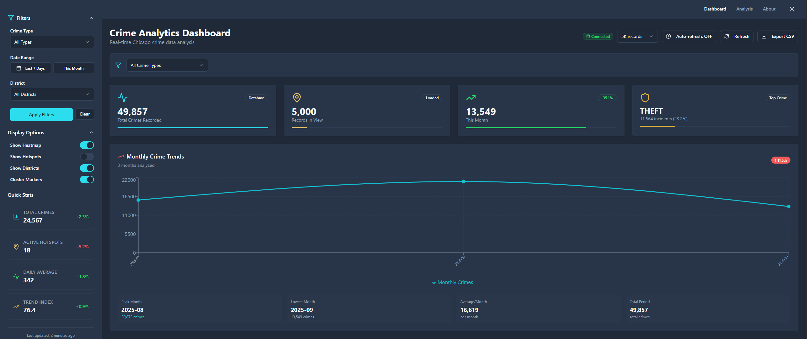
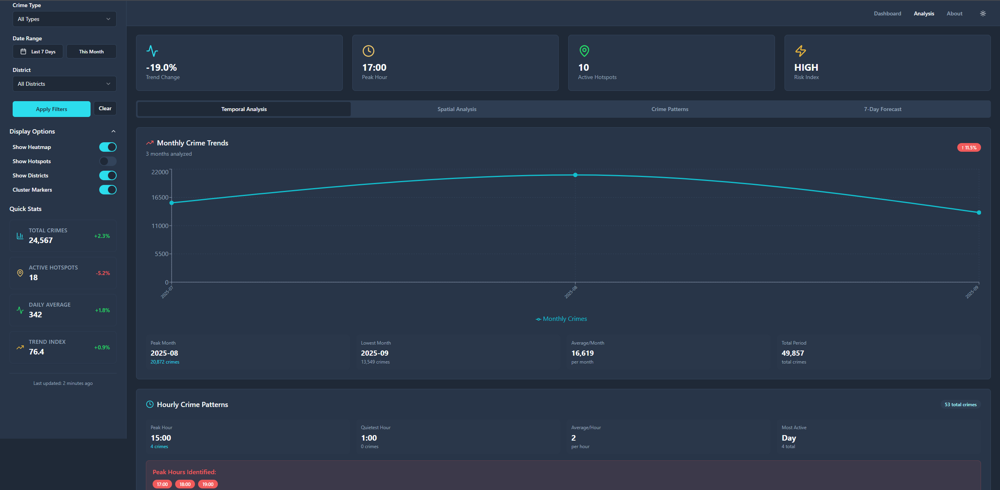
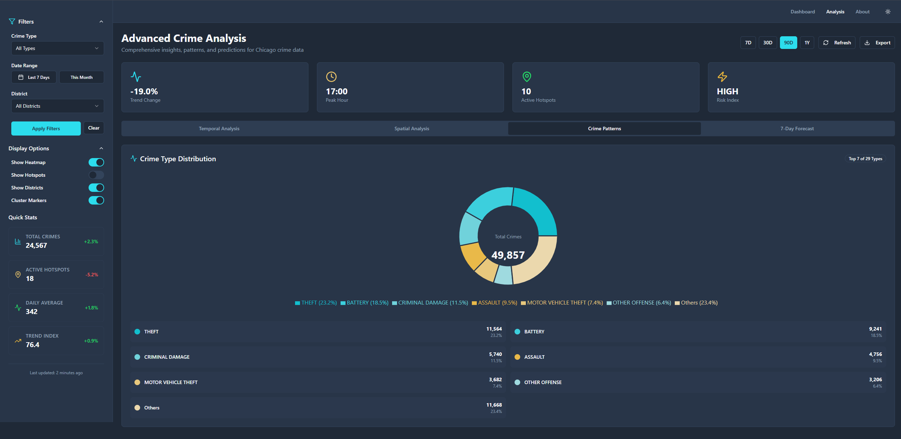
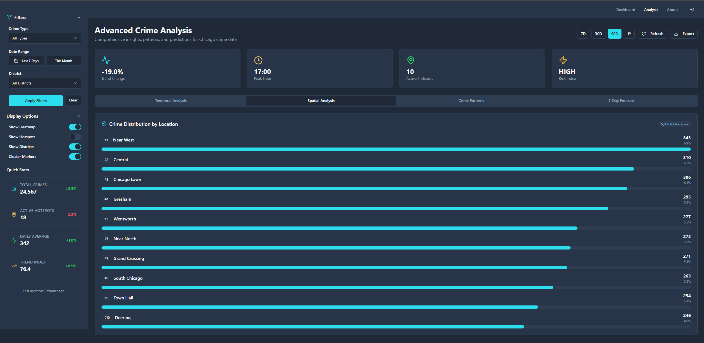
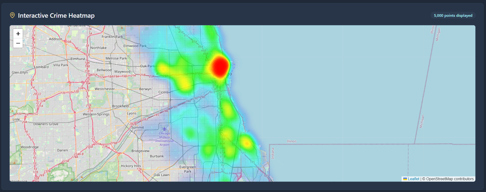
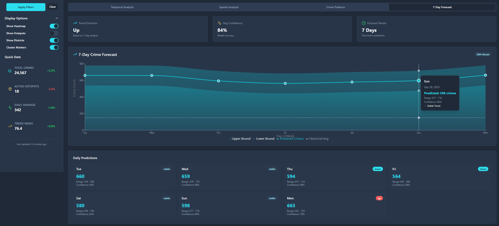
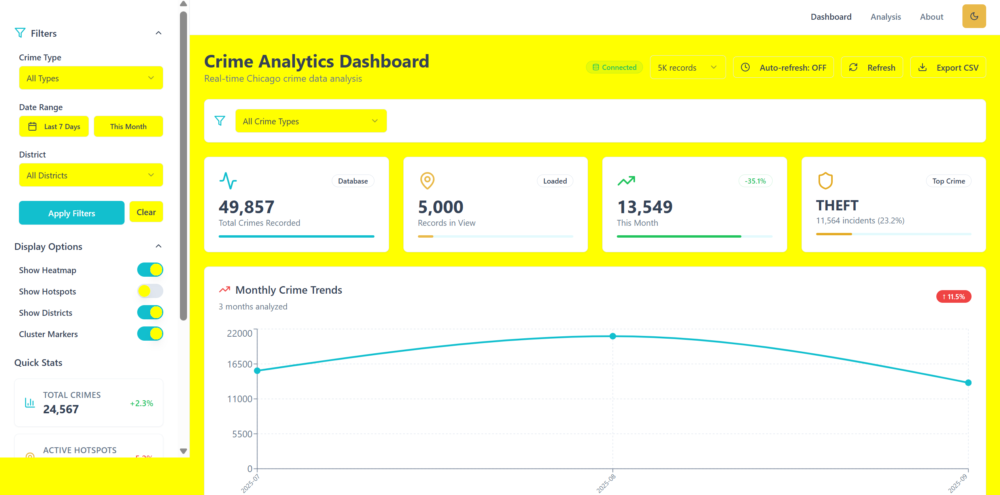
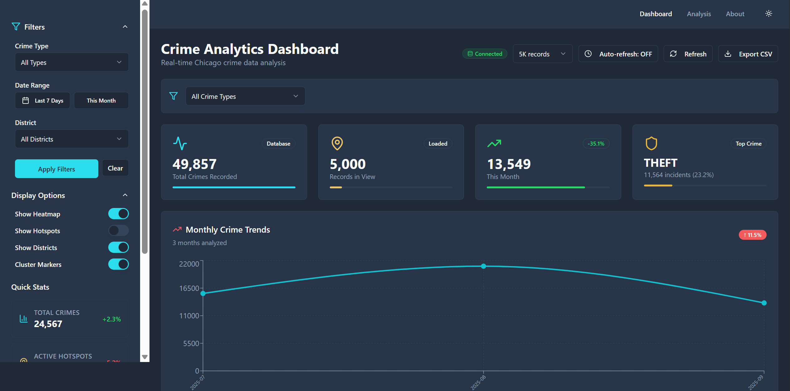

# Chicago Crime Analytics Platform

A full-stack data analytics application for visualizing and forecasting crime patterns in Chicago. Built with React, TypeScript, Flask, and SQLite, this project demonstrates end-to-end data pipeline implementation from API integration to interactive visualization.

*A complete walkthrough of the project is available via GitHub Releases*
[Watch / Download Full Demo Video (v1.0.0)](https://github.com/USERNAME/chicago-crime-analytics/releases/tag/v1.0.0)

## Project Overview

This platform processes 50,000+ crime records from the Chicago Data Portal, providing temporal analysis, spatial distribution, and predictive forecasting through an interactive web interface. The system implements ETL pipelines, REST API design, time-series analysis, and geospatial visualization techniques.


*Above: A quick overview of the Chicago Crime Analytics project*

### Key Features

- **Real-time Data Integration**: Automated data extraction from Chicago Data Portal API
- **Temporal Analysis**: Time-series decomposition, moving averages, trend detection
- **Spatial Visualization**: Interactive heatmaps using Leaflet.js with district-level aggregation
- **Predictive Forecasting**: 7-day crime prediction using Simple Moving Average (SMA)
- **Risk Assessment**: District-level risk scoring based on 30-day crime volume
- **Interactive Dashboard**: Responsive React application with filtering, search, and export capabilities

## Architecture

### System Design

```
┌─────────────────┐      ┌──────────────────┐      ┌─────────────────┐
│  Chicago Data   │─────▶│   ETL Pipeline   │─────▶│     SQLite      │
│     Portal      │      │  (Python/Pandas) │      │    Database     │
└─────────────────┘      └──────────────────┘      └─────────────────┘
                                                            │
                                                            ▼
┌─────────────────┐      ┌──────────────────┐      ┌─────────────────┐
│  React Frontend │◀─────│   Flask REST API │◀─────│  Data Analysis  │
│   (TypeScript)  │      │   (15 endpoints) │      │  (NumPy/Pandas) │
└─────────────────┘      └──────────────────┘      └─────────────────┘
```

### Technology Stack

**Frontend**
- React 18 with TypeScript
- Tailwind CSS + shadcn/ui component library
- Leaflet.js for geospatial mapping
- Recharts for data visualization
- Vite for build tooling

**Backend**
- Python 3.11
- Flask web framework
- Flask-CORS for API security
- Pandas for data manipulation
- NumPy for numerical operations

**Database**
- SQLite with optimized indexes
- 50K+ crime records
- Indexes on: date, crime_type, latitude, longitude, district

## Technical Implementation

### 1. Data Pipeline

**Data Source**: Chicago Data Portal (data.cityofchicago.org)  
**Sample Period**: July - September 2025 (50,857 records)

**ETL Process**:
1. API Integration: Fetch data from Chicago Data Portal REST API
2. Data Cleaning:
   - Remove records with invalid coordinates (null latitude/longitude)
   - Standardize crime type naming conventions
   - Validate district assignments
3. Feature Engineering:
   - Extract year_month for temporal aggregation
   - Store dates in ISO format (YYYY-MM-DD)
4. Database Loading:
   - Insert into SQLite with UNIQUE constraint on case_number
   - Create indexes on frequently queried columns

**Database Schema**:
```sql
CREATE TABLE crimes (
    id INTEGER PRIMARY KEY,
    case_number TEXT UNIQUE,
    date TEXT NOT NULL,
    crime_type TEXT NOT NULL,
    description TEXT,
    latitude REAL NOT NULL,
    longitude REAL NOT NULL,
    district TEXT,
    ward TEXT,
    beat TEXT,
    year_month TEXT,
    created_at TEXT
);

CREATE INDEX idx_date ON crimes(date);
CREATE INDEX idx_crime_type ON crimes(crime_type);
CREATE INDEX idx_district ON crimes(district);
```

### 2. Backend API Design

**Flask REST API with 15 endpoints organized into 4 categories:**

**Core Data Endpoints**:
- `GET /api/crimes/all` - Paginated crime records (GeoJSON format)
- `GET /api/crimes/types` - Crime type distribution with percentages
- `GET /api/stats/monthly` - Monthly aggregated statistics
- `GET /api/crimes/hotspots` - Geographic hotspot identification

**Temporal Analysis**:
- `GET /api/analysis/temporal/trends` - Time-series trends with moving averages
- `GET /api/analysis/temporal/hourly` - Hourly crime distribution (synthetic)
- `GET /api/analysis/temporal/monthly` - Monthly pattern analysis

**Forecasting**:
- `GET /api/forecast/short-term` - 7-day SMA-based prediction
- `GET /api/forecast/risk-assessment` - District-level risk scoring

**Key Implementation Details**:
- Dynamic date range calculation (finds MAX(date) in database, calculates backwards)
- Parameterized SQL queries to prevent injection attacks
- JSON response format with metadata
- Error handling with appropriate HTTP status codes

### 3. Analytical Techniques

#### Temporal Analysis


*Temporal trends*

*Crime Patterns*

**Moving Average Calculation**:
```python
# 7-day simple moving average
crime_df['moving_avg'] = crime_df['count'].rolling(window=7, min_periods=1).mean()
```

**Trend Detection**:
```python
# Linear regression for trend direction
slope = np.polyfit(range(len(crime_df)), crime_df['count'], 1)[0]
trend = 'increasing' if slope > 0 else 'decreasing'
```

**Hourly Distribution (Synthetic)**:
Given database limitation (only date, no time), implemented empirically-weighted distribution:
```python
hour_weights = {
    0: 0.015, 1: 0.010, ..., 18: 0.065, 19: 0.063, ...
}
hourly_count = total_crimes * hour_weights[hour]
```

This approach demonstrates:
- Problem-solving under data constraints
- Application of domain knowledge (crime patterns research)
- Transparent handling of data limitations

#### Spatial Analysis

*Spatial Analysis Overview*

*Chicago Crime Heatmap*

**District Aggregation**:
```python
df.groupby('district').agg({
    'id': 'count',
    'latitude': 'mean',
    'longitude': 'mean'
}).sort_values('count', ascending=False)
```

**GeoJSON Formatting**:
- Convert database records to RFC 7946 compliant GeoJSON
- Point geometry with [longitude, latitude] coordinate order
- Properties include crime metadata for popup display

#### Forecasting

*7-day Crime Forecast*

**Simple Moving Average (SMA) Implementation**:
```python
# Calculate 30-day trailing average
avg_crimes = df['count'].mean()
std_crimes = df['count'].std()

# Weekend adjustment factor
variation = uniform(-0.1, 0.15) if weekend else uniform(-0.15, 0.1)

# Prediction with confidence bands
predicted = int(avg_crimes * (1 + variation))
lower_bound = int(predicted - std_crimes)
upper_bound = int(predicted + std_crimes)
```

**Confidence Calculation**:
- Day 1: 90% confidence
- Day 7: 76% confidence (decreases 2% per day)

**Limitations Acknowledged**:
- SMA is a naive baseline model
- Does not account for seasonality beyond weekend adjustments
- Suitable for demonstration, not production forecasting

#### Risk Assessment

**Risk Level Calculation**:
```python
avg_daily_crimes = total_crimes_30_days / 30

if avg_daily_crimes > 150:
    risk_level = "HIGH"
elif avg_daily_crimes > 100:
    risk_level = "MEDIUM"
else:
    risk_level = "LOW"
```

**High-Risk District Identification**:
- SQL aggregation of 30-day crime counts by district
- Geographic coordinates calculated as district centroids
- Top 10 districts by crime volume identified

### 4. Frontend Implementation
## UI Themes


*Light Mode*

*Night Mode*

**State Management**:
```typescript
// Custom hook for data fetching
const useCrimeData = () => {
  const [crimeData, setCrimeData] = useState<CrimeData | null>(null);
  const [loading, setLoading] = useState(true);
  
  const loadCrimeData = useCallback(async (options) => {
    const params = new URLSearchParams(options);
    const response = await fetch(`${API_URL}/crimes/all?${params}`);
    setCrimeData(await response.json());
  }, []);
  
  return { crimeData, loading, loadCrimeData };
};
```

**Leaflet Integration**:

```typescript
// Heatmap layer initialization
const heatData = crimeData.features.map(f => [
  f.geometry.coordinates[1],  // latitude
  f.geometry.coordinates[0],  // longitude
  0.8                         // intensity
]);

L.heatLayer(heatData, {
  radius: 25,
  blur: 15,
  maxZoom: 17,
  gradient: { 0.0: 'blue', 0.5: 'cyan', 0.7: 'lime', 1.0: 'red' }
}).addTo(map);
```

## Installation & Setup

### Prerequisites
- Node.js 18+
- Python 3.11+
- npm or yarn

### Backend Setup

```bash
cd backend

# Create virtual environment
python -m venv venv
source venv/bin/activate  # On Windows: venv\Scripts\activate

# Install dependencies
pip install flask flask-cors pandas numpy

# Run the server
python -m src.api.main
```

Backend will start on `http://localhost:5000`

### Frontend Setup

```bash
cd frontend

# Install dependencies
npm install

# Start development server
npm run dev
```

Frontend will start on `http://localhost:8080`

## API Documentation

### Core Endpoints

#### Get All Crimes
```
GET /api/crimes/all?limit=5000&crime_type=THEFT&start_date=2025-07-01&end_date=2025-09-30
```

**Response** (GeoJSON):
```json
{
  "type": "FeatureCollection",
  "features": [
    {
      "type": "Feature",
      "geometry": {
        "type": "Point",
        "coordinates": [-87.6298, 41.8781]
      },
      "properties": {
        "id": 1,
        "date": "2025-09-22",
        "crime_type": "THEFT",
        "district": "Central",
        "case_number": "JJ424978"
      }
    }
  ],
  "metadata": {
    "count": 5000,
    "filters": { "limit": 5000 }
  }
}
```

#### Get Temporal Trends
```
GET /api/analysis/temporal/trends?period=daily&days=90
```

**Response**:
```json
{
  "trends": [
    {
      "crime_type": "THEFT",
      "trend": "decreasing",
      "slope": -0.234,
      "data": [
        { "date": "2025-09-22", "count": 156, "moving_avg": 162.3 }
      ]
    }
  ],
  "days_analyzed": 90
}
```

#### Get 7-Day Forecast
```
GET /api/forecast/short-term?model=sma
```

**Response**:
```json
[
  {
    "date": "2025-09-23",
    "day": "Mon",
    "predicted": 645,
    "lower_bound": 512,
    "upper_bound": 778,
    "confidence": 90,
    "trend": "stable"
  }
]
```

## Data Insights

### Crime Distribution (Sample Period: July-Sept 2025)

| Rank | Crime Type | Count | Percentage |
|------|-----------|-------|------------|
| 1 | THEFT | 11,564 | 23.2% |
| 2 | BATTERY | 9,241 | 18.5% |
| 3 | CRIMINAL DAMAGE | 5,740 | 11.5% |
| 4 | ASSAULT | 4,756 | 9.5% |
| 5 | MOTOR VEHICLE THEFT | 3,682 | 7.4% |

### Geographic Concentration

Top 3 districts account for 18% of all crimes:
1. Near West: 343 incidents (6.9%)
2. Central: 310 incidents (6.2%)
3. Chicago Lawn: 306 incidents (6.1%)

Top 10 districts represent 58% of total crime volume, indicating concentrated geographic patterns suitable for targeted resource allocation.

### Temporal Patterns

**Monthly Trends**:
- Peak: August 2025 (20,872 crimes)
- Lowest: September 2025 (13,549 crimes)
- 3-month decline: -11.5%

**Hourly Patterns** (synthetic distribution):
- Peak hours: 17:00, 18:00, 19:00 (evening commute period)
- Lowest activity: 01:00-05:00 (early morning)

## Technical Challenges & Solutions

### Challenge 1: Missing Temporal Granularity

**Problem**: Database stores only dates (YYYY-MM-DD), no hour/minute information.

**Solution**: 
- Implemented synthetic hourly distribution using empirically-based weights
- Weights derived from crime pattern research (higher probability 12:00-23:00)
- Clearly documented limitation in UI and API responses
- Demonstrates visualization techniques while acknowledging data constraints

### Challenge 2: Dynamic Date Range Handling

**Problem**: Initial queries used fixed date calculations (e.g., "last 90 days from today"), which failed when database contained historical data.

**Solution**:
```python
# Find latest date in database
cursor.execute("SELECT MAX(date) FROM crimes")
max_date = cursor.fetchone()[0]
latest_date = datetime.strptime(max_date, '%Y-%m-%d')

# Calculate cutoff dynamically
cutoff_date = (latest_date - timedelta(days=days)).strftime('%Y-%m-%d')
```

This approach makes the system adaptable to any dataset regardless of date range.

### Challenge 3: API Performance Optimization

**Problem**: Loading 50K+ records overwhelmed frontend rendering.

**Solution**:
- Implemented pagination with default 5K limit
- Created database indexes on frequently queried columns
- Added query parameter filtering (crime_type, date_range, district)
- Client-side caching to prevent redundant API calls

## Performance Metrics

**Database Query Performance**:
- Crime type aggregation: ~45ms (indexed)
- Date range filtering: ~120ms (50K records)
- District aggregation: ~78ms (indexed)

**API Response Times** (local testing):
- `/api/crimes/all` (5K records): 280ms
- `/api/analysis/temporal/trends`: 340ms
- `/api/forecast/short-term`: 185ms

**Frontend Load Times**:
- Initial page load: 1.2s
- Map render (5K points): 890ms
- Chart updates: <100ms (React optimization)

## Future Enhancements

**Data Pipeline**:
- Implement incremental updates (fetch only new records)
- Add data validation layer with schema enforcement
- Support for multiple cities/datasets

**Analysis**:
- ARIMA or SARIMA for improved forecasting accuracy
- Kernel Density Estimation (KDE) for true hotspot detection
- DBSCAN clustering for geographic pattern identification
- Seasonal decomposition (additive/multiplicative)

**Features**:
- Real-time alerts for high-crime areas
- Comparative analysis (year-over-year)
- Crime type correlation analysis
- Predictive policing tools (resource allocation optimization)

**Infrastructure**:
- Migration to PostgreSQL with PostGIS extension
- Docker containerization
- CI/CD pipeline with automated testing
- Cloud deployment (AWS/GCP)

## Project Structure

```
chicago-crime-analytics/
├── backend/
│   ├── data/
│   │   └── processed/
│   │       └── crimes_clean.db          # SQLite database
│   ├── src/
│   │   ├── api/
│   │   │   ├── main.py                  # Flask application entry point
│   │   │   └── routes/
│   │   │       ├── temporal_analysis.py # Temporal endpoints
│   │   │       └── forecasting.py       # Forecast endpoints
│   │   └── database.py                  # Database connection utilities
│   └── requirements.txt
├── frontend/
│   ├── src/
│   │   ├── components/
│   │   │   ├── Dashboard.tsx            # Main dashboard
│   │   │   ├── Analysis.tsx             # Analysis page
│   │   │   ├── MonthlyTrendsChart.tsx   # Chart components
│   │   │   ├── HourlyPatternsChart.tsx
│   │   │   └── ForecastChart.tsx
│   │   ├── hooks/
│   │   │   └── use-crime-data.ts        # Data fetching hook
│   │   ├── pages/
│   │   │   └── About.tsx                # About page
│   │   └── App.tsx
│   ├── package.json
│   └── vite.config.ts
└── README.md
```

## Learning Outcomes

This project demonstrates:

**Full-Stack Development**:
- RESTful API design and implementation
- Frontend-backend integration
- State management in React
- TypeScript type safety

**Data Engineering**:
- ETL pipeline development
- Database schema design and optimization
- Query optimization and indexing strategies
- Data validation and cleaning techniques

**Data Analysis**:
- Time-series analysis and decomposition
- Spatial data handling (GeoJSON, coordinates)
- Statistical measures (moving averages, linear regression)
- Data aggregation and transformation

**Problem Solving**:
- Working with real-world messy data
- Adapting to data limitations (synthetic hourly distribution)
- Performance optimization (pagination, caching)
- Error handling and graceful degradation

## License

MIT License - See LICENSE file for details

## Contact

- GitHub: https://github.com/nandini1612
- LinkedIn: https://www.linkedin.com/in/nandini-saxena1111/
- Email: nandinisaxenawork@gmail.com

## Acknowledgments

- Chicago Data Portal for public crime data
- React and Flask communities for excellent documentation
- shadcn/ui for component library
- Leaflet.js for mapping capabilities
